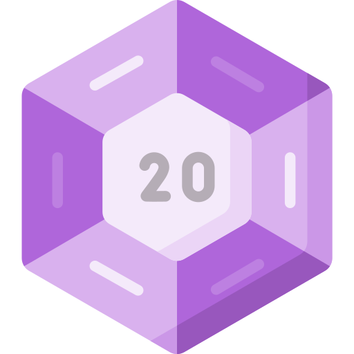
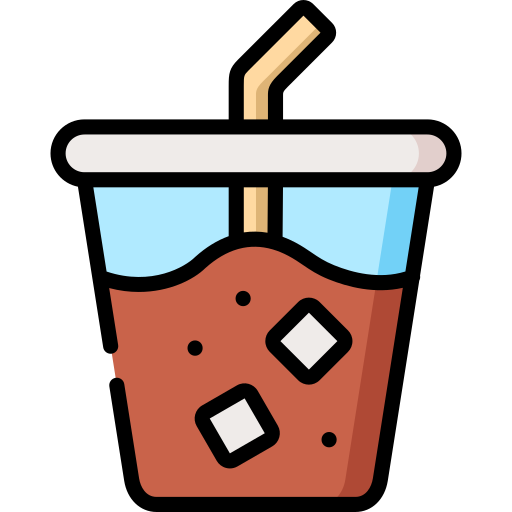

    

  
  
  

 

<h1 align="center">
Welcome to my GitHub
    
</h1>

<h3>I am a Full Stack Software Developer excited about creating websites and applications that help people become more productive and efficient in their endeavors. My passion is to make interfaces more intuitive for all users and create tools that allow people to build a world that works better for everyone.</h3>

 

<!-- <h3> What I am currently working on</h3> -->

<!-- ___ -->
 

<h3> A little about me</h3>

___
 

-  I absolutely love cooking. Want to chat about recipes or work on a food related project, feel free to hit me up.
-  I will procrastinate to play with your pup!
-  Love some DND
-   Iced coffee every morning

 
 

<h3> Coding Playlist I love </h3>

---
<ul dir="auto">
<li><a href="https://open.spotify.com/playlist/7GmGc99r7Qjdw4763y95V2?si=eb4080ccbe014f2c" rel="nofollow">Smiths</a></li>
<li><a href="https://open.spotify.com/playlist/5Jm8YoUgGWBPzSqMMXVY6i?si=7f18359f7a324092" rel="nofollow">Castle Party</a></li>
<li><a href="https://open.spotify.com/playlist/7o393327DKW7sVfNDfQlgi?si=7e00e1cbda064763" rel="nofollow">Change it up Vol.2</a></li>

</ul>

 

 
<h3>Languages</h3>

___

 
 

&nbsp;&nbsp;&nbsp;&nbsp;&nbsp;&nbsp;

 
 

## My Projects

___

 

- ### Tech Spotlight
  
  - Tech Spotlight scrapes Indeed.com and returns frequency of technologies found in all postings scraped. It uses the search queries,job title, location, date of post and returns a file of most popular technologies. We plotted our findings in a Jupyter Notebook.
  - [Repo](https://github.com/regex-rejects/tech-spotlight)
  - [Jupyter Notebook](https://www.kaggle.com/code/edenbrekke/tech-spotlight-indeed-data-18may2022/notebook)
  
- ### Do or DOOM

  - A task list application that allows a user to create tasks,set a due date, and add an accountability partner. If that task is not completed by the due date a text message is sent to your accountability partner. This application uses a next.js frontend and a Django backend with an ElephantSQL database.
  - [Front End Repo](https://github.com/TheG0ATS/do-or-doom-fe)
  - [Back End Repo](https://github.com/TheG0ATS/do-or-doom-api)
  

- ### Animal Racer

  - Animal Racer is a web-based trivia game built in JavaScript. Each turn has a new animal trivia question and if you answer correctly, you move closer to the finish line. Your opponent, the computer, races you around the track and has a probability of answering correctly.
  - [Repo](https://github.com/The-Go-Gitters/trivia-race)
